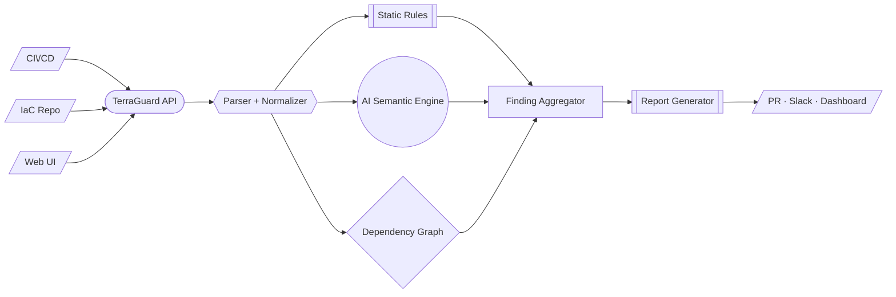

# TerraGuard

AI-powered Infrastructure-as-Code security analysis for Terraform, built for fast developer feedback and clear remediation.

[](https://www.python.org/)
[](https://flask.palletsprojects.com/)
[](https://platform.openai.com/)
[](./LICENSE)

## What TerraGuard Solves

IaC security reviews often break down in one of two ways:
- Static tools are deterministic but miss context-dependent risk.
- AI-only analysis is flexible but lacks structure for real engineering workflows.

TerraGuard combines structured finding output with LLM reasoning so teams can scan Terraform quickly, triage by severity, and act on concrete fixes.

## Current MVP Scope

The current implementation is a working MVP, focused on Terraform file analysis:
- Web UI with paste, drag-drop, and file upload for `.tf`/`.tfvars`
- Flask API endpoint (`POST /analyze`)
- GPT-4o powered finding generation
- Severity-ranked output: `CRITICAL`, `HIGH`, `MEDIUM`, `LOW`, `INFO`
- Rich finding details: title, resource, line hint, description, fix, CWE, tags

## High-Level Design (HLD)

Complete architecture document (with symbols, flow legend, and lifecycle):
- [ARCHITECTURE_HLD.md](docs/ARCHITECTURE_HLD.md)
- [Architecture Visual (HTML + SVG)](docs/architecture/terraguard-hld.html)

Quick snapshot:



## Detection Coverage (MVP)

| Domain | Example checks |
| --- | --- |
| IAM | Wildcard actions/principals, over-permissive policies |
| Network | Open SG ingress (`0.0.0.0/0`) on sensitive ports |
| Storage | Public buckets, missing encryption settings |
| Secrets | Hardcoded credentials in Terraform definitions |
| Database | Public RDS, insecure instance settings |
| Logging / Visibility | Missing audit/logging controls when identifiable |

## Local Run

### 1) Install dependencies

```bash
python3 -m venv .venv
source .venv/bin/activate
pip install -r requirements.txt
```

### 2) Configure environment

```bash
cp .env.example .env
```

Edit `.env`:

```bash
OPENAI_API_KEY="your_openai_api_key"
# optional (defaults to gpt-4o)
OPENAI_MODEL="gpt-4o"
```

### 3) Start app

```bash
python app.py
```

Open `http://localhost:5000`.

Health check:

```bash
curl http://localhost:5000/health
```

## API Contract

### Request

`POST /analyze`

```json
{
  "code": "resource \"aws_s3_bucket\" \"example\" { ... }"
}
```

### Response

```json
{
  "findings": [
    {
      "id": "TG-001",
      "severity": "HIGH",
      "title": "Publicly accessible S3 bucket",
      "resource": "aws_s3_bucket.example",
      "line_hint": "resource aws_s3_bucket.example",
      "description": "Bucket allows public access.",
      "fix": "Set block public access and private ACL.",
      "cwe": "CWE-284",
      "tags": ["s3", "access-control"]
    }
  ],
  "summary": {
    "CRITICAL": 0,
    "HIGH": 1,
    "MEDIUM": 0,
    "LOW": 0,
    "INFO": 0
  },
  "total": 1
}
```

## Repository Layout

```text
TERRAGUARD/
├── .env.example                  # Environment template
├── LICENSE
├── app.py                        # Flask backend + OpenAI analysis call
├── static/
│   ├── index.html                # Frontend editor + findings UI
│   └── favicon.svg
├── docs/
│   ├── ARCHITECTURE_HLD.md       # Detailed HLD and data-flow modeling
│   └── architecture/
│       └── terraguard-hld.html   # Shareable architecture visual
└── requirements.txt
```

## Roadmap

1. CLI and pre-commit support
2. SARIF/JUnit report output for CI policy gates
3. Multi-file and module-aware analysis
4. Policy-as-code layer (OPA/Rego)
5. Historical findings, trend analytics, and audit export

## LinkedIn Summary (Ready-to-Post)

TerraGuard is an AI-powered IaC security MVP that analyzes Terraform code and produces severity-ranked findings with actionable remediation. The platform is designed as a hybrid architecture: parser/normalizer, multi-engine analysis (static + semantic AI + dependency graph), finding aggregation, policy controls, and multi-channel reporting. Current release includes a working Flask + web UI scanner with GPT-4o-backed risk detection; HLD is defined for CI/CD integration, policy governance, observability, and enterprise deployment growth.

## License

MIT
