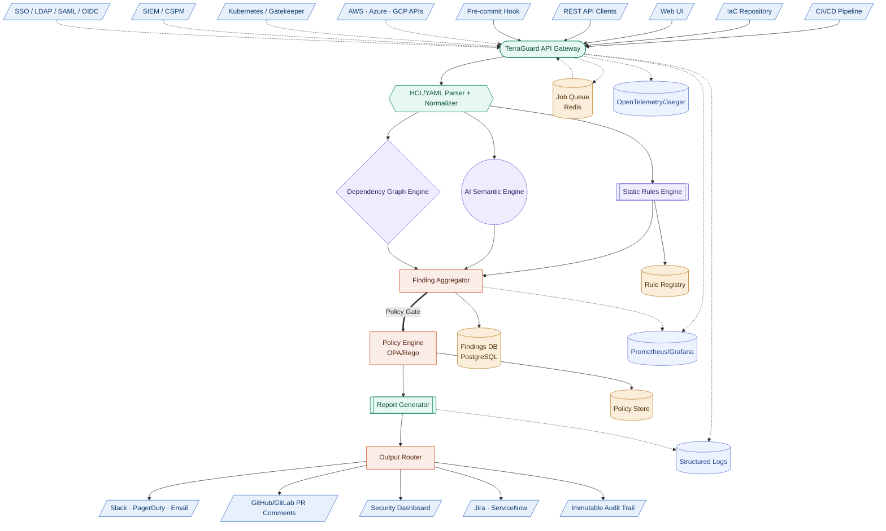
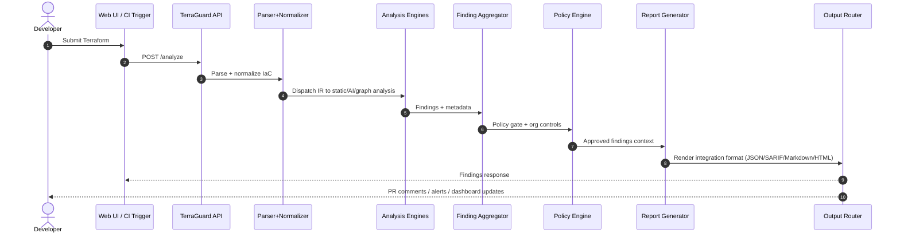

# TerraGuard High-Level Design (HLD)

This document describes the TerraGuard architecture as a production-oriented design while clearly separating the current MVP from planned expansion.

## 1) System Boundary

`Current MVP (implemented now)`:
- Web UI (`static/index.html`)
- Flask API (`app.py`)
- OpenAI-powered Terraform analysis
- Structured finding output and severity summary

`Target expansion (planned)`:
- Multi-source ingestion (CI, REST, pre-commit)
- Multi-engine analysis pipeline
- Policy engine and report adapters
- Data plane, queueing, observability, and enterprise integrations

## 2) Symbol Legend

| Symbol type | Meaning |
| --- | --- |
| `/parallelogram/` | External input/output channel |
| `([stadium])` | API/service entrypoint |
| `{{hexagon}}` | Parser/normalization logic |
| `[[subroutine]]` | Deterministic processing component |
| `((circle))` | AI semantic reasoning component |
| `{diamond}` | Graph/decision logic |
| `[rectangle]` | Internal orchestration component |
| `[(cylinder)]` | Persistent data store |

## 3) Data Flow Legend

| Line type | Meaning |
| --- | --- |
| `-->` | Synchronous request-response flow |
| `-.->` | Asynchronous/event or telemetry flow |
| `==>` | Governance or policy-enforced flow |

## 4) End-to-End HLD

## 5) Scan Lifecycle (Sequence)

## 6) Component Responsibilities

| Component | Responsibility | MVP status |
| --- | --- | --- |
| API Gateway | Accept scan input, validate payload, orchestrate analysis call | Implemented |
| Parser + Normalizer | Convert IaC into common representation | Partial (Terraform text context in MVP) |
| Static Rules Engine | Deterministic control checks | Planned |
| AI Semantic Engine | Context-aware risk reasoning | Implemented (LLM-backed) |
| Dependency Graph Engine | Cross-resource risk paths | Planned |
| Finding Aggregator | Deduplicate + prioritize findings | Partial (MVP severity summary) |
| Policy Engine | OPA/Rego org controls | Planned |
| Report Generator | Multi-format reporting | Partial (JSON API + UI rendering) |
| Data Plane | History, policies, registry, queue | Planned |
| Observability | Metrics, traces, logs | Planned |

## 7) Deployment Modes

- Local dev: single Flask process + static assets
- Team mode (planned): containerized API + worker + Redis + PostgreSQL
- Enterprise mode (planned): Kubernetes, SSO, policy bundles, audit export
